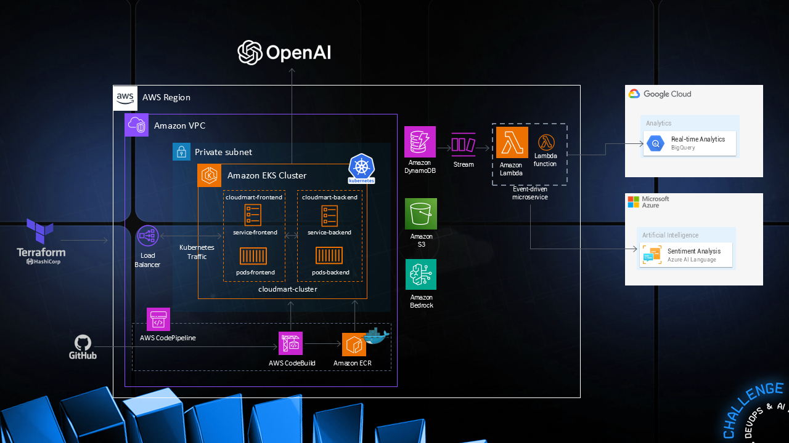

# MultiCloud, DevOps & AI Challenge - Day 1  


    
    Remember to use the class replay as a reference.  

    

## Streamlined Guide: Using Claude as AI Assistant to Terraform  

### Step 1: Use Claude to Generate Terraform Code  
1. Start a conversation with Claude.  
2. Ask Claude to create Terraform code for an S3 bucket. Use a prompt like:  
"Please provide Terraform code to create an S3 bucket in AWS with a unique name."  
3. Claude should generate code similar to this:  

    ```
    provider "aws" {  
    region = "us-west-2"  # Replace with your desired    region  
    }  
    
    resource "random_id" "bucket_suffix" {  
    byte_length = 8  
    }  
    
    resource "aws_s3_bucket" "my_bucket" {  
    bucket = "my-unique-bucket-name-${random_id.  bucket_suffix.hex}"  

    tags = {  
        Name        = "My bucket"  
        Environment = "Dev"  
    }  
    }  
    
    resource "aws_s3_bucket_acl" "my_bucket_acl" {  
    bucket = aws_s3_bucket.my_bucket.id  
    acl    = "private"  
    }  
    
    ```

4. Save this code for use in Step 5.  
  
### Step 2: Create IAM Role for EC2  
  
1. Log in to the AWS Management Console.  
2. Navigate to the IAM dashboard.  
3. Click "Roles" in the left sidebar, then "Create   role".  
4. Choose "AWS service" as the trusted entity type and "EC2" as the use case.  
5. Search for and attach the "AdministratorAccess" policy.   
Note: In a production environment, use a more restricted policy.  
6. Name the role "EC2Admin" and provide a description.  
7. Review and create the role.  

## Step 3: Launch EC2 Instance  

1. Go to the EC2 dashboard in the AWS Management Console.  
2. Click "Launch Instance".  
3. Choose an Amazon Linux 2 AMI.  
4. Select a t2.micro instance type.  
5. Configure instance details:  
    - Network: Default VPC  
    - Subnet: Any available  
    - Auto-assign Public IP: Enable  
    - IAM role: Select "EC2Admin"  
6. Keep default storage settings.  
7. Add a tag: Key="Name", Value="workstation".  
8. Create a security group allowing SSH access from EC2 Connect IP.  
9. Review and launch, selecting or creating a key pair.  

## Step 4: Connect to EC2 Instance and Install Terraform  

1. From the EC2 dashboard, select your "workstation" instance.  
2. Click "Connect" and use the "EC2 Instance Connect" method.  
3. In the browser-based SSH session, update system packages:  

    ```
    sudo yum update -y  
    
    ```

4. Install yum-utils:  

    ```
    sudo yum install -y yum-utils  
    
    ```

5. Add HashiCorp repository:
  
    ```
    sudo yum-config-manager --add-repo https://rpm.releases.hashicorp.com/AmazonLinux/hashicorp.repo  
    
    ```

6. Install Terraform:  

    ```
    sudo yum -y install terraform  
    
    ```

7. Verify installation:  

    ```
    terraform version  
    
    ```

## Step 5: Apply Terraform Configuration  

1. Create a new directory and navigate to it:  
  
    ```
    mkdir terraform-project && cd terraform-project  
    
    ```

2. Create and open main.tf:  

    ```
    nano main.tf  
    
    ```

3. Paste the Terraform code generated by Claude in Step 1.  
4. Save and exit the editor (in nano, press Ctrl+X, then Y, then Enter).  
5. Initialize Terraform:  

    ```
    terraform init  
   
    ```

6. Review the plan:   

    ```
    terraform plan  
  
    ```  

7. Apply the configuration:  

    ```
    terraform apply  
  
    ```  

8. Type "yes" when prompted to create the resources.  

## Step 6: Verify S3 Bucket Creation  

1. Use AWS CLI to list buckets:  
    
    ```
    aws s3 ls  
    
    ```
    
2. Verify that your new bucket is in the list.  

## Step 7: Create the Cloud DynamoDB tables
    ```
    Remove the S3 lines and add the lines below to create the DynamoDB tables used by CloudMart  
    provider "aws" {
    region = "us-east-1"  
    }

    # Tables DynamoDB
    resource "aws_dynamodb_table" "cloudmart_products" {
    name           = "cloudmart-products"
    billing_mode   = "PAY_PER_REQUEST"
    hash_key       = "id"

    attribute {
        name = "id"
        type = "S"
    }
    }

    resource "aws_dynamodb_table" "cloudmart_orders" {
    name           = "cloudmart-orders"
    billing_mode   = "PAY_PER_REQUEST"
    hash_key       = "id"

    attribute {
        name = "id"
        type = "S"
    }
    }

    resource "aws_dynamodb_table" "cloudmart_tickets" {
    name           = "cloudmart-tickets"
    billing_mode   = "PAY_PER_REQUEST"
    hash_key       = "id"

    attribute {
        name = "id"
        type = "S"
    }
    }

    ```
1. Apply the configuration:  

    ```
    terraform apply

    ```
2. Type "yes" when prompted to create the resources.



